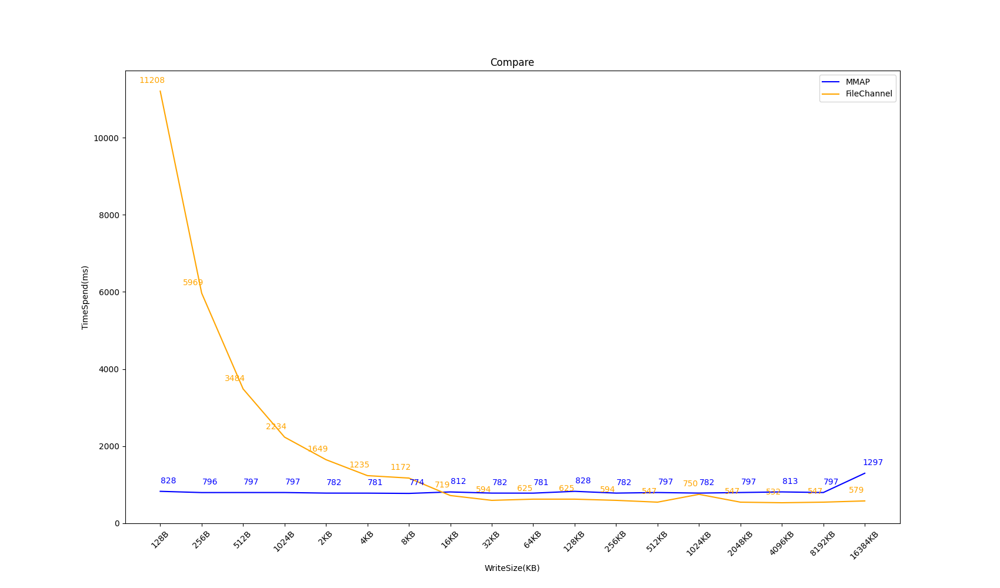

    

<strong>

[English](README.md) | [简体中文](README_CHN.md)

</strong>

---

## What is Korona-DB
**Korona-DB** is a Log-structured Key-Value storage database based on [**Bitcask model**](https://riak.com/assets/bitcask-intro.pdf)  
It not only inherits the excellent features of Bitcask but also makes many improvements to enhance write performance

Project name source from a classical typewriter "**Corona**" on last century  
First letter is homophonic letter taken from "***K*ey**"

## Advantages
- low latency per item read or written
- high throughput, especially when writing an incoming stream of random items
- single disk seek can get any data
- ability to handle datasets much larger than RAM without degradation
- crash friendliness, both in terms of fast recovery and not losing data(need to setting)
- a relatively simple, understandable (and thus supportable) code structure and data format
- simple to backup datafile
- supports multiple way to write data
- support custom any key-type and value-type

## Architecture overview

## Features

### Base
> ### Implement of Bitcask
> - [X] Only one file in writing(append to end), other file is readonly
> - [X] Keydir index based by HashMap
> - [X] Understandable data-struct
> - [X] Data merge(compaction) process
> - [X] Simple interface provide like User-CLI, library reference and resp protocol(coming soon) 
> - [X] HintFile generate by Keydir automatic dump, load into the memory when korona start
> ### Schedule features
> - [ ] More humanized User-CLI
> - [ ] RESP Protocol support
> - [ ] Better write performance
> - [ ] More datatype support
> - [ ] ByteBuffer poll
> - [ ] Multiply operate pipeline
> - [ ] Distributed system
> - [ ] GraalVM native support

### Engine features
- **`Bucket`**: 
  - use FileChannel(append write) to append
  - application buffer area and flexible rules to flush into disk
  - multiply write rules
    - customize buffer size in application space
    - use slide-windows to automatic control flush data when database load is low
    - customize flush methods:
      - write into datafile each time
      - write into datafile each time and force flush
      - write into buffer first and background flush by rule(maybe will get losing data in buffer when database crashed)
- **`Enigma`**:
  - memory-mappings write support(is **very high-performance in situation like small-data writing**)
  - memory warmup before writing

## Project require
> - Java17+ (maybe will migrate to Java21)

## Performance

### Benchmark
**Coming soon...**

### Other funny test result 

|  |  |
|:-----------------------------------------:|:-----------------------------------------:|

###### ~~***(This funny test is not rigorous and is for reference only)***~~