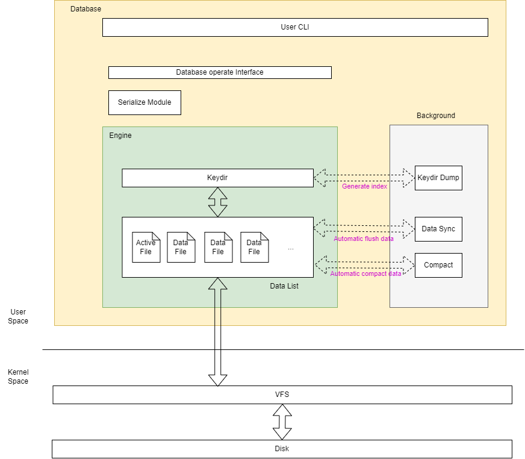
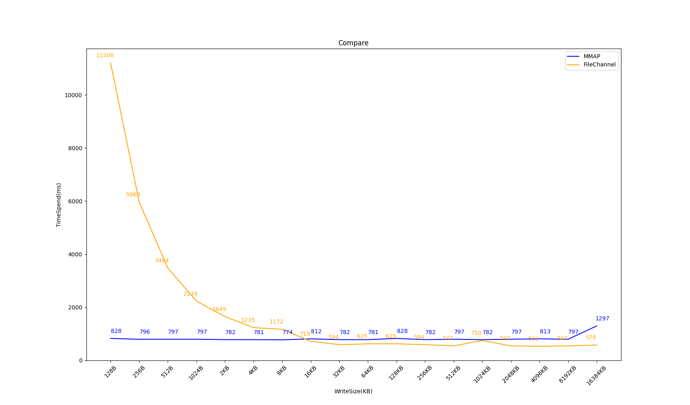

    

<strong>

[English](README.md) | [简体中文](README_CHN.md)

</strong>

---

## 什么是Korona-DB
**Korona-DB** 是一个基于 [**Bitcask model**](https://riak.com/assets/bitcask-intro.pdf) 的日志结构KV型数据库  
不仅继承了Bitcask的优点，还在此基础上对写入性能做了优化

项目名字来源于上世纪一款经典的打字机 "**Corona**"  
首字母从C改为 "***K*ey**" 的首字母谐音 

## 优点
- 读写低延迟
- 对于完全无序的数据，也能保持比较高的吞吐量
- 一次磁盘IO便能找到数据
- 能够保持性能稳定的情况下处理远大于内存的数据集
- 崩溃友好，包括快速恢复和不丢失数据（可根据需求设置）
- 相对简单和易懂的数据格式和代码结构
- 简单的文件备份以及文件迁移方式
- 支持多种写入的机制和设置
- 支持自定义任意键值类型

## 架构总览

## 功能特性

### 基本
> ### 已实现Bitcask的功能
> - [X] 单文件写入、其它文件只读，并支持文件自动切换
> - [X] 基于哈希表的Keydir内存索引
> - [X] 容易理解的数据结构
> - [X] 定时数据合并压缩
> - [X] 提供简单的使用方式，例如用户命令行CLI接口、类库方式调用等
> - [X] Keydir定期持久化（HintFile），每次启动优先从HintFile读取，加快索引构建速度
> ### 未来计划功能
> - [ ] 更加人性化的CLI界面以及指令
> - [ ] RESP协议支持
> - [ ] 更高的写入性能
> - [ ] 更多数据类型的支持
> - [ ] 单次执行多条操作指令
> - [ ] 分布式支持
> - [ ] GraalVM原生镜像支持

### 支持引擎
- **`Bucket`**: 
  - 使用 **FileChannel**（底层是write()） 进行追加写
  - 支持程序内部的缓冲区并可以设置灵活的刷盘规则
  - 支持多种写入方式
    - 可自定义内存读写缓冲区大小
    - 支持设置滑动窗口参数来根据负载情况自动刷新缓冲区
    - 可自定义刷入规则:
      - 每次都写入文件
      - 每次都写入文件并强制刷新
      - 先写入内部读写缓冲区，后台根据实际设定规则刷新数据至文件（程序崩溃时可能会丢失缓冲区的数据）
- **`Enigma`**:
  - 基于内存映射的高效写入(**在小数据场景下有着十分强劲的写入性能**)
  - 通过内存预热来提升读写速度

## 版本需求
> - Java17+ (之后可能会迁移到Java21或以上)

## 性能参考

### 基准测试
**等待后续测试...**

### 相对不严谨的测试

|  |  |
|:-----------------------------------------:|:-----------------------------------------:|

###### ~~***(该测试为底层方法的测试，并不是Korona-DB本身的测试)***~~